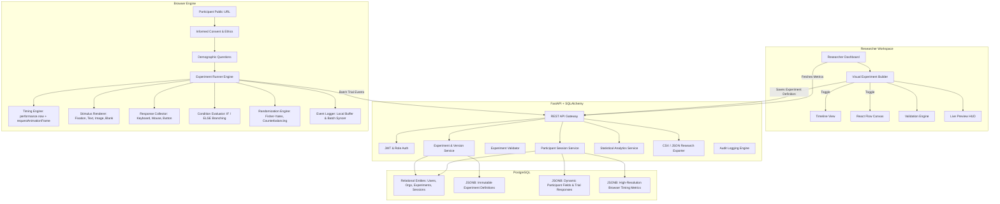

# CogniLab Architecture & System Design

CogniLab is a production-quality SaaS web platform engineered specifically for cognitive, behavioral, neuroscience, and HCI researchers to visually construct, publish, execute, and analyze browser-based behavioral experiments.

---

## 1. High-Level System Architecture

---

## 2. Core Architectural Pillars

### A. Browser-Side Timing Independence
In behavioral cognitive science, reaction times (RT) must reflect cognitive processing latencies rather than internet network round-trips.
- **Client-Side High-Resolution Clocks**: Uses `window.performance.now()` with sub-millisecond precision.
- **VSYNC Synchronization**: Utilizes double `requestAnimationFrame()` to guarantee that visual stimuli are committed to the screen before starting the reaction-time clock.
- **No Server-Side Latency Dependency**: The FastAPI backend is never in the critical path of reaction-time measurement.

### B. Relational Foundation + PostgreSQL JSONB
Researchers frequently modify participant fields (e.g. age, handedness, sleep hours, native language) and trial response formats without requiring schema migrations.
- Stable entities (`users`, `organizations`, `experiments`, `experiment_versions`, `participant_sessions`, `consent_records`, `trial_results`, `audit_logs`) use standard relational columns with foreign keys and indexes.
- Experiment graph definitions, participant schemas, and trial responses are stored in **PostgreSQL JSONB** columns.
- On SQLite (local development fallback), SQLAlchemy maps JSONB dynamically to JSON.

### C. Immutable Versioning for Scientific Reproducibility
- Every published experiment is permanently stamped with an immutable `ExperimentVersion`.
- When a researcher updates an experiment, a new version is created.
- Participant sessions store the exact `experiment_version_id` used during the trial run.

### D. Privacy-by-Design and Participant Data Separation
- **No Participant Accounts**: Participants access studies via pseudonymous URLs without providing email or registering.
- **Cryptographic Pseudonyms**: Each session receives a cryptographically generated identifier (e.g., `P-8A9F1C02`).
- **Separation of Concerns**: Researcher demographic schemas are isolated from researcher dashboard metadata.
